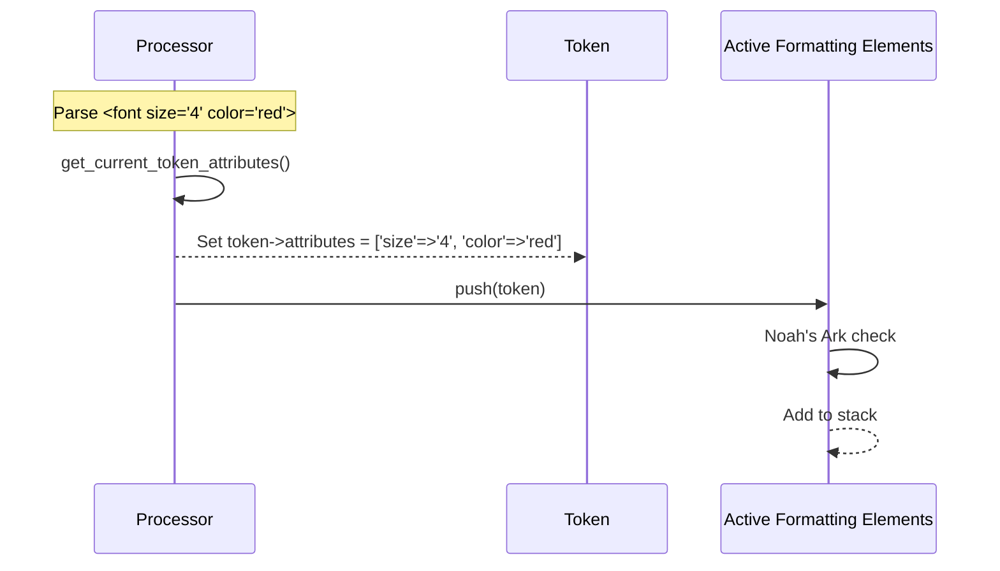
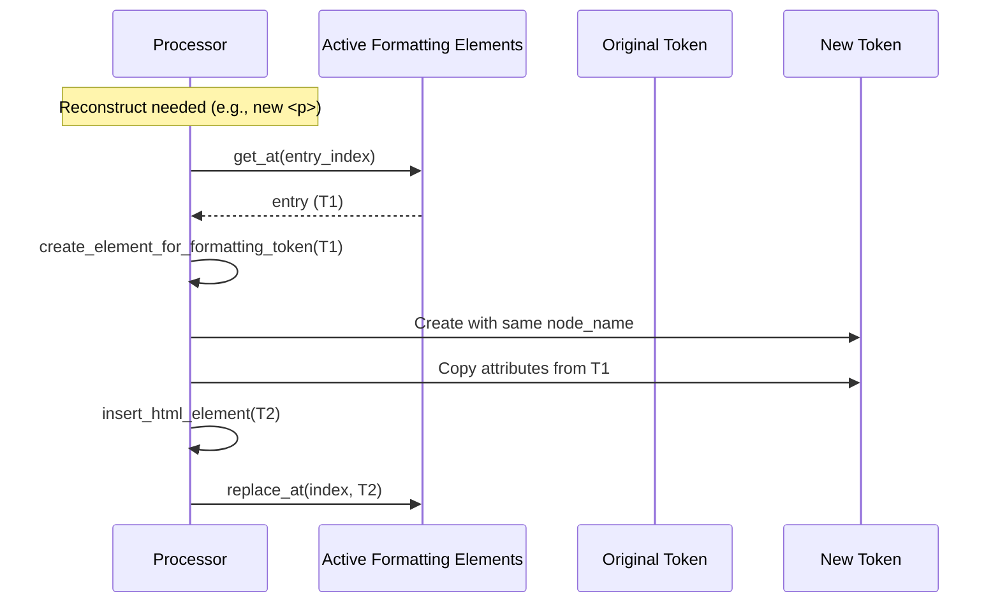
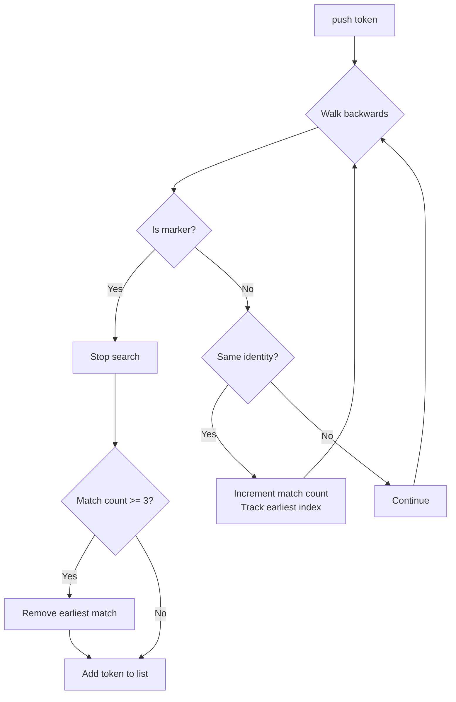

# Detailed Design: Attribute Handling and Noah's Ark Clause

## Overview

This document describes the implementation of attribute handling for active formatting element reconstruction and the Noah's Ark clause in `WP_HTML_Processor`. This builds on the existing reconstruct active formatting elements algorithm (Iteration 1) by adding:

1. **Attribute Handling** - Store and clone attributes when reconstructing formatting elements
2. **Noah's Ark Clause** - Limit duplicate formatting elements to 3 per tag+attribute combination

These features are required for full HTML5 specification compliance and will enable 9 additional html5lib tests to pass.

---

## Detailed Requirements

### Functional Requirements

#### Attribute Handling
1. **Capture attributes at push time** - When a formatting element is pushed to the active formatting elements list, capture all its attributes as a normalized key-value map
2. **Clone attributes during reconstruction** - When reconstructing a formatting element, copy the stored attributes to the new token
3. **Expose virtual attributes** - Reconstructed elements must expose their attributes via `get_attribute()` and `get_attribute_names_with_prefix()`
4. **Attribute normalization** - Store attribute names in lowercase, values as exact strings

#### Noah's Ark Clause
5. **Limit duplicates to 3** - When pushing a formatting element, if 3 identical elements already exist (same tag, namespace, attributes), remove the earliest one
6. **Scope to markers** - Only check elements after the last marker (or entire list if no markers)
7. **Attribute comparison** - Two elements match if they have identical tag name, namespace, and all attributes match (case-insensitive names, exact values, order-independent)

### Non-Functional Requirements

1. **No regressions** - All currently passing tests must continue to pass
2. **Performance** - Attribute capture should be efficient; only formatting elements store attributes
3. **Memory** - Minimal overhead; attributes stored as simple arrays
4. **Code style** - Follow WordPress PHP coding standards

### Success Criteria

| Criterion | Measure |
|-----------|---------|
| Attribute handling | 8 previously-skipped tests pass |
| Noah's Ark | 1 previously-skipped test passes |
| No regressions | 1105 currently passing tests still pass |
| API complete | `get_attribute()` works on reconstructed elements |

---

## Architecture Overview

```
┌─────────────────────────────────────────────────────────────────────────────┐
│                           WP_HTML_Processor                                  │
├─────────────────────────────────────────────────────────────────────────────┤
│                                                                              │
│  Formatting Element Push Flow:                                               │
│  ┌──────────────────────────────────────────────────────────────────────┐   │
│  │ 1. Process <b class="bold"> tag                                      │   │
│  │ 2. Capture attributes: ['class' => 'bold']                           │   │
│  │ 3. Store on token: $token->attributes = [...]                        │   │
│  │ 4. Push to active_formatting_elements->push($token)                  │   │
│  │    └── Noah's Ark check: remove oldest if 3 identical exist          │   │
│  └──────────────────────────────────────────────────────────────────────┘   │
│                                                                              │
│  Reconstruction Flow:                                                        │
│  ┌──────────────────────────────────────────────────────────────────────┐   │
│  │ 1. REWIND: Find start point (existing)                               │   │
│  │ 2. ADVANCE: For each entry                                           │   │
│  │    a. create_element_for_formatting_token($entry)                    │   │
│  │       └── Copy $entry->attributes to $new_token->attributes          │   │
│  │    b. insert_html_element($new_token)                                │   │
│  │    c. replace_at($index, $new_token)                                 │   │
│  └──────────────────────────────────────────────────────────────────────┘   │
│                                                                              │
│  Attribute Access Flow:                                                      │
│  ┌──────────────────────────────────────────────────────────────────────┐   │
│  │ get_attribute('class')                                               │   │
│  │ └── Check current_token->attributes (virtual)                        │   │
│  │     └── If found: return virtual attribute                           │   │
│  │     └── Else: standard source HTML lookup                            │   │
│  └──────────────────────────────────────────────────────────────────────┘   │
│                                                                              │
└─────────────────────────────────────────────────────────────────────────────┘
                                    │
                                    ▼
┌─────────────────────────────────────────────────────────────────────────────┐
│                    WP_HTML_Active_Formatting_Elements                        │
├─────────────────────────────────────────────────────────────────────────────┤
│                                                                              │
│  push($token) - UPDATED with Noah's Ark:                                     │
│  ┌──────────────────────────────────────────────────────────────────────┐   │
│  │ 1. Walk backwards from end of list                                   │   │
│  │ 2. Stop at marker (if any)                                           │   │
│  │ 3. Count elements matching $token (tag + namespace + attributes)     │   │
│  │ 4. If count >= 3: remove earliest match                              │   │
│  │ 5. Add $token to list                                                │   │
│  └──────────────────────────────────────────────────────────────────────┘   │
│                                                                              │
│  New helper methods:                                                         │
│  - elements_have_same_identity($a, $b): bool                                │
│  - attributes_are_equal($a, $b): bool                                       │
│                                                                              │
└─────────────────────────────────────────────────────────────────────────────┘
                                    │
                                    ▼
┌─────────────────────────────────────────────────────────────────────────────┐
│                           WP_HTML_Token                                      │
├─────────────────────────────────────────────────────────────────────────────┤
│  Existing properties:                                                        │
│  - bookmark_name, node_name, has_self_closing_flag                          │
│  - namespace, integration_node_type, on_destroy                             │
│                                                                              │
│  NEW property:                                                               │
│  - $attributes: ?array = null                                               │
│    Format: ['class' => 'bold', 'id' => 'main']                              │
│    Keys: lowercase attribute names                                           │
│    Values: decoded attribute values (string) or true (boolean attrs)        │
│                                                                              │
└─────────────────────────────────────────────────────────────────────────────┘
```

---

## Components and Interfaces

### 1. WP_HTML_Token - New Attribute Storage

Add a new property to store attributes:

```php
/**
 * Attributes associated with this token.
 *
 * For formatting elements in the active formatting elements list,
 * this stores the attributes as they were when the element was created.
 * Used for reconstruction and Noah's Ark duplicate detection.
 *
 * Keys are lowercase attribute names, values are decoded strings
 * or `true` for boolean attributes.
 *
 * @since 6.8.0
 *
 * @var array<string, string|true>|null
 */
public $attributes = null;
```

### 2. WP_HTML_Processor - Attribute Capture

New helper method to capture current token's attributes:

```php
/**
 * Captures all attributes from the current token as an array.
 *
 * Returns an associative array with lowercase attribute names as keys
 * and decoded attribute values as values. Boolean attributes have
 * the value `true`.
 *
 * @since 6.8.0
 *
 * @return array<string, string|true> Attribute name-value pairs.
 */
private function get_current_token_attributes(): array {
    $attributes = array();
    $names = $this->get_attribute_names_with_prefix( '' );

    if ( null === $names ) {
        return $attributes;
    }

    foreach ( $names as $name ) {
        $attributes[ $name ] = $this->get_attribute( $name );
    }

    return $attributes;
}
```

### 3. WP_HTML_Processor - Updated Push Pattern

Update all locations where formatting elements are pushed:

```php
// Before (current):
$this->state->active_formatting_elements->push( $this->state->current_token );

// After (new):
$this->state->current_token->attributes = $this->get_current_token_attributes();
$this->state->active_formatting_elements->push( $this->state->current_token );
```

### 4. WP_HTML_Processor - Updated Reconstruction

Modify `create_element_for_formatting_token()` to clone attributes:

```php
private function create_element_for_formatting_token( WP_HTML_Token $entry ): WP_HTML_Token {
    /*
     * Create a virtual bookmark for this reconstructed element.
     */
    $bookmark_name = $this->bookmark_token();
    $here = $this->bookmarks[ $this->state->current_token->bookmark_name ];
    $this->bookmarks[ $bookmark_name ] = new WP_HTML_Span( $here->start, 0 );

    /*
     * Create new token with same tag name as the original.
     */
    $new_token = new WP_HTML_Token( $bookmark_name, $entry->node_name, false );
    $new_token->namespace = 'html';

    /*
     * Clone attributes from the original entry.
     * This ensures reconstructed elements have the same attributes
     * as the token for which they were created.
     */
    if ( null !== $entry->attributes ) {
        $new_token->attributes = $entry->attributes;
    }

    return $new_token;
}
```

### 5. WP_HTML_Processor - Virtual Attribute Access

Override or extend `get_attribute()` to check virtual attributes:

```php
public function get_attribute( $name ) {
    /*
     * For reconstructed elements with virtual attributes,
     * return the stored attribute value.
     */
    if (
        isset( $this->state->current_token ) &&
        null !== $this->state->current_token->attributes
    ) {
        $comparable = strtolower( $name );
        if ( array_key_exists( $comparable, $this->state->current_token->attributes ) ) {
            return $this->state->current_token->attributes[ $comparable ];
        }
        // Virtual element has no other attributes
        return null;
    }

    // Standard attribute lookup from source HTML
    return parent::get_attribute( $name );
}
```

Similarly for `get_attribute_names_with_prefix()`:

```php
public function get_attribute_names_with_prefix( $prefix ): ?array {
    /*
     * For reconstructed elements with virtual attributes,
     * return matching attribute names from stored attributes.
     */
    if (
        isset( $this->state->current_token ) &&
        null !== $this->state->current_token->attributes
    ) {
        if ( $this->is_tag_closer() ) {
            return null;
        }

        $comparable = strtolower( $prefix );
        $matches = array();

        foreach ( array_keys( $this->state->current_token->attributes ) as $name ) {
            if ( str_starts_with( $name, $comparable ) ) {
                $matches[] = $name;
            }
        }

        return $matches;
    }

    return parent::get_attribute_names_with_prefix( $prefix );
}
```

### 6. WP_HTML_Active_Formatting_Elements - Noah's Ark

Update `push()` method with Noah's Ark logic:

```php
public function push( WP_HTML_Token $token ) {
    /*
     * Noah's Ark clause: Limit to 3 identical formatting elements.
     *
     * > If there are already three elements in the list of active formatting
     * > elements after the last marker, if any, or anywhere in the list if
     * > there are no markers, that have the same tag name, namespace, and
     * > attributes as element, then remove the earliest such element from
     * > the list of active formatting elements.
     *
     * @see https://html.spec.whatwg.org/#push-onto-the-list-of-active-formatting-elements
     */
    $dominated_by_noah = 3;
    $dominated_count = 0;
    $earliest_match_index = null;

    // Walk backwards, counting matches until we hit a marker
    for ( $i = count( $this->stack ) - 1; $i >= 0; $i-- ) {
        $entry = $this->stack[ $i ];

        // Markers stop the search
        if ( 'marker' === $entry->node_name ) {
            break;
        }

        // Check if this entry matches the token being pushed
        if ( self::elements_have_same_identity( $token, $entry ) ) {
            ++$dominated_count;
            $earliest_match_index = $i;
        }
    }

    // If 3 identical elements exist, remove the earliest
    if ( $dominated_count >= $dominated_by_noah && null !== $earliest_match_index ) {
        array_splice( $this->stack, $earliest_match_index, 1 );
    }

    // Add element to the list
    $this->stack[] = $token;
}
```

### 7. WP_HTML_Active_Formatting_Elements - Element Comparison

New helper methods for element identity comparison:

```php
/**
 * Determines if two tokens represent the same formatting element.
 *
 * Two elements are considered identical if they have the same:
 * - Tag name
 * - Namespace
 * - Attributes (names, namespaces, and values)
 *
 * @since 6.8.0
 *
 * @param WP_HTML_Token $a First token.
 * @param WP_HTML_Token $b Second token.
 * @return bool Whether the tokens represent identical formatting elements.
 */
private static function elements_have_same_identity( WP_HTML_Token $a, WP_HTML_Token $b ): bool {
    // Tag name must match
    if ( $a->node_name !== $b->node_name ) {
        return false;
    }

    // Namespace must match
    if ( $a->namespace !== $b->namespace ) {
        return false;
    }

    // Attributes must match
    return self::attributes_are_equal(
        $a->attributes ?? array(),
        $b->attributes ?? array()
    );
}

/**
 * Determines if two attribute arrays are equal.
 *
 * Comparison is case-insensitive for names, exact for values,
 * and order-independent.
 *
 * @since 6.8.0
 *
 * @param array $a First attributes array.
 * @param array $b Second attributes array.
 * @return bool Whether the attributes are equal.
 */
private static function attributes_are_equal( array $a, array $b ): bool {
    // Different count means different attributes
    if ( count( $a ) !== count( $b ) ) {
        return false;
    }

    // Empty arrays are equal
    if ( 0 === count( $a ) ) {
        return true;
    }

    // Compare each attribute (keys already lowercase from capture)
    foreach ( $a as $name => $value ) {
        if ( ! array_key_exists( $name, $b ) ) {
            return false;
        }
        if ( $value !== $b[ $name ] ) {
            return false;
        }
    }

    return true;
}
```

---

## Data Models

### WP_HTML_Token (Updated)

```php
class WP_HTML_Token {
    public $bookmark_name;           // string|null
    public $node_name;               // string (uppercase tag name or 'marker')
    public $has_self_closing_flag;   // bool
    public $namespace;               // string ('html', 'svg', 'math')
    public $integration_node_type;   // string|null
    public $on_destroy;              // callable|null

    // NEW
    public $attributes;              // array<string, string|true>|null
}
```

### Attribute Array Format

```php
// Example: <font size="4" color="red">
$token->attributes = [
    'size'  => '4',
    'color' => 'red',
];

// Example: <input disabled>
$token->attributes = [
    'disabled' => true,  // Boolean attribute
];

// Example: <b> (no attributes)
$token->attributes = [];

// Example: Token not from active formatting elements
$token->attributes = null;
```

---

## Data Flow Diagrams

### Attribute Capture Flow



### Reconstruction Flow



### Noah's Ark Flow



---

## Error Handling

### Removed Bail Points

The current bail in `create_element_for_formatting_token()` for attributes will be removed:

```php
// REMOVE this code:
if ( $entry_bookmark->length > $min_length ) {
    $this->bail( 'Cannot reconstruct active formatting element with attributes.' );
}
```

### Edge Cases

1. **No attributes** - Token has `$attributes = []` (empty array), not null
2. **Boolean attributes** - Stored as `true`, returned as `true` from `get_attribute()`
3. **Null attributes** - Non-formatting tokens have `$attributes = null`, use standard lookup
4. **Empty string values** - Preserved as empty string `''`

---

## Testing Strategy

### Unit Tests

#### Attribute Storage Tests

```php
/**
 * @group html-api
 */
class Tests_HtmlApi_WpHtmlProcessorAttributeHandling extends WP_UnitTestCase {

    public function test_formatting_element_stores_attributes() {
        $processor = WP_HTML_Processor::create_fragment( '<b class="bold">text' );
        $processor->next_tag( 'B' );
        // Verify attribute is accessible
        $this->assertSame( 'bold', $processor->get_attribute( 'class' ) );
    }

    public function test_reconstructed_element_has_cloned_attributes() {
        $processor = WP_HTML_Processor::create_fragment( '<p><b class="bold">text<p>more' );
        // Navigate to second paragraph
        $processor->next_tag( 'P' );
        $processor->next_tag( 'B' );
        $processor->next_tag( 'P' );

        // Find reconstructed B
        $processor->next_tag( 'B' );
        $this->assertSame( 'bold', $processor->get_attribute( 'class' ) );
    }

    public function test_reconstructed_element_lists_attribute_names() {
        $processor = WP_HTML_Processor::create_fragment( '<p><b id="x" class="y">text<p>more' );
        $processor->next_tag( 'P' );
        $processor->next_tag( 'B' );
        $processor->next_tag( 'P' );
        $processor->next_tag( 'B' );

        $names = $processor->get_attribute_names_with_prefix( '' );
        $this->assertContains( 'id', $names );
        $this->assertContains( 'class', $names );
    }
}
```

#### Noah's Ark Tests

```php
class Tests_HtmlApi_WpHtmlProcessorNoahsArk extends WP_UnitTestCase {

    public function test_noahs_ark_limits_to_three_identical_elements() {
        // Four identical <b> tags, only 3 should be reconstructed
        $processor = WP_HTML_Processor::create_fragment( '<p><b><b><b><b><p>X' );

        // Navigate to second paragraph
        $processor->next_tag( 'P' );
        for ( $i = 0; $i < 4; $i++ ) {
            $processor->next_tag( 'B' );
        }
        $processor->next_tag( 'P' );

        // Count reconstructed B elements (should be 3, not 4)
        $breadcrumbs = $processor->get_breadcrumbs();
        $b_count = count( array_filter( $breadcrumbs, fn( $b ) => $b === 'B' ) );
        $this->assertSame( 3, $b_count );
    }

    public function test_noahs_ark_considers_attributes_for_identity() {
        // Different attributes = different elements
        $processor = WP_HTML_Processor::create_fragment(
            '<p><b class="a"><b class="b"><b class="c"><b class="d"><p>X'
        );

        // All 4 should be reconstructed (different attributes)
        // Navigate and count...
    }

    public function test_noahs_ark_respects_markers() {
        // Markers reset the count
        // Test with table cell (inserts marker)
    }
}
```

### Integration Tests (html5lib)

Target tests that should pass after implementation:

| Test | Type |
|------|------|
| tests23/line0001 | Attributes + Noah's Ark |
| tests23/line0041 | Attributes + Noah's Ark |
| tests23/line0069 | Attributes + Noah's Ark |
| tests23/line0101 | Attributes |
| tests26/line0001 | Attributes |
| tests26/line0263 | Attributes |
| adoption01/line0159 | Attributes |
| adoption01/line0318 | Noah's Ark |
| tricky01/line0078 | Attributes |

### Test Commands

```bash
# Run all html-api tests
WP_TESTS_SKIP_INSTALL=1 ./vendor/bin/phpunit --group html-api

# Run html5lib tests
WP_TESTS_SKIP_INSTALL=1 ./vendor/bin/phpunit --group html-api-html5lib-tests

# Run specific test file
WP_TESTS_SKIP_INSTALL=1 ./vendor/bin/phpunit --filter AttributeHandling

# Run specific html5lib test
WP_TESTS_SKIP_INSTALL=1 ./vendor/bin/phpunit --filter "tests23/line0001"
```

---

## Appendices

### A. Technology Choices

| Decision | Choice | Rationale |
|----------|--------|-----------|
| Attribute storage | Property on WP_HTML_Token | Simple, matches spec "attributes as they were when created" |
| Attribute format | `array<string, string\|true>` | Consistent with existing `get_attribute()` return types |
| Key normalization | Lowercase | HTML attributes are case-insensitive |
| Noah's Ark location | In `push()` method | Single responsibility, encapsulation |
| Comparison methods | Static private helpers | Reusable, testable |

### B. Research Findings Summary

- 8 tests blocked by attribute reconstruction bail
- 1 test explicitly skipped for Noah's Ark
- Spec requires attributes "as they were when created"
- Noah's Ark threshold is 3, not configurable
- Attribute comparison: case-insensitive names, exact values, order-independent

### C. Alternative Approaches Considered

1. **Re-read attributes from bookmark**
   - Rejected: Doesn't work for already-reconstructed elements

2. **Separate attribute storage class**
   - Rejected: Adds complexity without benefit

3. **Store raw HTML for attributes**
   - Rejected: Requires re-parsing, less efficient

4. **Noah's Ark in processor instead of list class**
   - Rejected: List class already owns push logic

### D. Future Considerations

1. **Attribute namespaces** - Currently only HTML attributes; foreign content may need namespace tracking
2. **Performance optimization** - If attribute comparison becomes a bottleneck, consider caching identity hashes
3. **Adoption agency** - This work enables future adoption agency algorithm which also needs attribute handling
